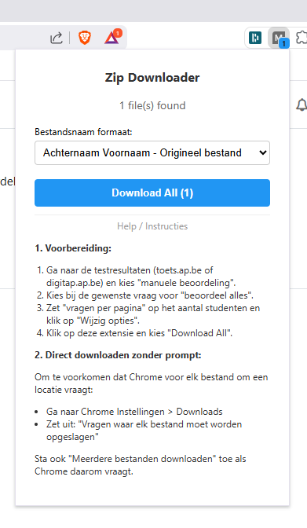

# Moodle Toolkit voor AP Hogeschool

Deze toolkit helpt docenten met twee veelvoorkomende taken in Moodle (`toets.ap.be` en `digitap.ap.be`):

1. **Bijlagen downloaden** – download alle ingediende bestanden (zip, pdf, docx, …) van een toets of opdracht in één klik, automatisch hernoemd naar `Achternaam Voornaam_Bestandsnaam.ext`.
2. **Studenten aan een groep toevoegen** – plak een lijst studentennamen en voeg ze allemaal in één klik toe aan de geselecteerde Moodle-groep, inclusief detectie van typfouten.

Na het installeren krijg je in de browser een knop die een overlay opent met twee tabs (**Downloads** en **Groepen**). Welke tab actief is onthoudt de tool tussen sessies.

**Opgelet: de policy instellingen van AP laten niet toe dat je deze extensie kunt gebruiken. Je kan overwegen om met een andere Chromium browser (zoals Brave) te werken waar deze extensie ook op werkt.**

## Installatie

De **Bookmarklet** is de aanbevolen installatie omdat die beide functies bevat (downloaden én groepen) en werkt in elke browser zonder installatierechten.

1.  Ga naar de [Installatie Pagina](https://timdams.github.io/MassTestBijlageDownloader/install.html).
2.  Sleep de knop **Moodle Toolkit** naar uw bladwijzerbalk.
3.  Klik op de bladwijzer wanneer u op een Moodle-pagina bent.

### Alternatieve Installatie (Chrome extensie)

Indien u extensies mag installeren, kan u "extension.zip" downloaden van de "releases" pagina van dit project. **Let op:** de Chrome extensie bevat momenteel enkel de download-functionaliteit, niet het toevoegen van studenten aan groepen.

Volg onderstaande stappen om de extensie te installeren in Google Chrome (of Edge).

1.  **Uitpakken**:
    *   Klik met de rechtermuisknop op het ontvangen ZIP-bestand.
    *   Kies "Alles uitpakken..." en kies een plek op uw computer (bijvoorbeeld in Documenten).

2.  **Inladen in Chrome**:
    *   Open Google Chrome.
    *   Typ in de adresbalk: `chrome://extensions` en druk op Enter.
    *   Zet rechtsboven de schakelaar **Developer mode** (Ontwikkelaarsmodus) **AAN**.
    *   Klik linksboven op **Load unpacked** (Uitgepakte extensie laden).
    *   Blader naar de map die u in stap 1 heeft uitgepakt en selecteer deze.

### Alternatieve Installatie (Userscript)

Een **Tampermonkey Userscript** is ook beschikbaar (enkel de download-functie). Dit werkt via een script-manager extensie die vaak wel is toegestaan door bedrijfsbeleid.

*   [Bekijk de Userscript Handleiding](README_USERSCRIPT.md) voor instructies.

## Belangrijke Configuratie voor downloads (Eenmalig)

Om te zorgen dat u niet voor *elk* bestand apart op "Opslaan" moet klikken, moet u een instelling in Chrome aanpassen.

1.  Ga in Chrome naar **Instellingen** (drie puntjes rechtsboven > Instellingen).
2.  Klik in het linkermenu op **Downloads**.
3.  Zet de schakelaar **UIT** bij: *"Vragen waar elk bestand moet worden opgeslagen voor het downloaden"*.

### Brave Browser Gebruikers
Bij Brave staat deze instelling ook onder Instellingen → Downloads, maar heet het soms iets anders of staat het standaard aan ter bescherming.
Zoek naar **"Vragen waar een bestand moet worden opgeslagen voordat het wordt gedownload"** en zet dit **UIT**.

*Soms vraagt Chrome/Brave bij het eerste gebruik toestemming om meerdere bestanden tegelijk te downloaden van `toets.ap.be` of `digitap.ap.be`. Klik dan op **Toestaan**.*

## Gebruik 1: Bijlagen downloaden

1.  Ga naar de resultatenpagina van de toets op `toets.ap.be` of `digitap.ap.be`.
2.  Kies voor **Manuele beoordeling** (bij toetsen) of bekijk de inzendingen (bij opdrachten).
3.  Klik bij de vraag die u wilt downloaden op **Beoordeel alles**.
4.  **Belangrijk**: Zoek op de pagina naar de instelling **Vragen per pagina**. Zet dit getal op het totaal aantal studenten (zodat alle inzendingen op één pagina staan) en klik op **Wijzig opties**.
5.  Klik op de bladwijzer **Moodle Toolkit** in uw bladwijzerbalk. De overlay opent op de tab **Downloads**.
6.  U ziet hoeveel bestanden er gevonden zijn. Kies eventueel een ander bestandsnaam-formaat en klik op **Download All**.

Alle bestanden worden nu gedownload naar uw standaard downloadmap, netjes hernoemd met de naam van de student.

## Gebruik 2: Studenten aan een groep toevoegen

1.  Ga in Moodle naar **Cursus → Deelnemers → Groepen** en klik op uw groep.
2.  Klik op **Gebruikers toevoegen/verwijderen**. U bent nu op de pagina `group/members.php?group=...`.
3.  Klik op de bladwijzer **Moodle Toolkit** en open de tab **Groepen**.
4.  **Plak studentennamen** in het tekstvak — één per regel, typisch in formaat *Achternaam Voornaam*. Tabs (bv. uit een Excel-paste) worden automatisch als spaties gelezen. E-mailadressen werken ook.
5.  Klik op **Zoek & preview**. De tool zoekt elke naam op in Moodle en toont vier categorieën:
    *   ✓ **Gevonden** – exact gematcht in de cursusrooster, klaar om toe te voegen (default aangevinkt).
    *   ~ **Mogelijke matches (typfout?)** – niet exact gevonden, maar er is een student met 1–4 verschillen in de naam (Levenshtein-afstand). Toont de gesuggereerde naam met "X verschillen". **Default niet aangevinkt** — kruis aan indien correct.
    *   ⚠ **Al lid** – staat al in deze groep, wordt overgeslagen.
    *   ✗ **Niet gevonden** – komt niet voor in de cursusrooster.
6.  Vink eventueel studenten uit/aan en klik op **Voeg geselecteerde studenten toe**.
7.  De pagina wordt herladen zodat de bijgewerkte ledenlijst zichtbaar is.

**Tips:**
*   De matching is hoofdletter- en accent-insensitief. *Bárbara Nunes* en *barbara nunes* werken beide.
*   Volgorde maakt niet uit: *Achternaam Voornaam*, *Voornaam Achternaam* of *Achternaam, Voornaam* worden allemaal gematcht.
*   Multi-token achternamen (*Van Bouwel*, *Sanhaji El Makrini*) worden correct herkend.

## Responsible AI Disclaimer

Quasi deze hele applicatie, inclusief de github workflow en documentatie werd geschreven met behulp van **Gemini 3 Pro (High) in Antigravity** en **Claude (Sonnet/Opus) via Claude Code**.

Volgende prompts werden onder andere gebruikt:

* "ik wil een chrome extensie maken"
* "wanneer het op pagina's van een moodle (onder toets.ap.be) test komt moet het automatisch alle bijlagen downloaden die daar als links staan. het html document in de demofolder is een voorbeeld van zo'n pagina. Het moet daar de archief (zip) bijlagen downloaden. In het voorbeeld zijn er 3 ( redacted_2023.zip, BeastMasterNinja.zip en Examenredacted_2023OOP.zip )"
* "geen automatic download starten. de gebruiker moet op de extensie klikken en een knop induwen "download all" die dan start. De extensie toont wel al via een tellertje hoeveel zips het zal downloaden als op de knop wordt geduwd"
* "Dat werkt perfect. Nu wil ik het volgende. de naam van de zip moet gebaseerd zijn op de naam van de student. In demo file heb je bijvoorbeeld voor de eerste zip "<h4>Pogingnummer 1 voor REDACTED (REDACTED.REDACTED@student.ap.be)</h4>". de naam van de zip wordt dan "REDACTED REDACTED.zip"
* "dat werkt goed; ik wil echter achternaam en voornaam omdraaien in de bestandsnaam. Soms heeft een student meerdere achternamen, dus plaats gewoon steeds de voornaam achteraan (dus alle voor eerste spatie) maar blijf voor de rest van de achternaam af"
* "ik wil deze applicatie uitbreiden. … nu ivm groepen in een cursus aanmaken. de bookmarklet moet dus anders werken wanneer het op een group page is."
* "Er was een student met 1 schrijffout in de excel. die werd dan uiteraard niet gevonden. is er manier om fuzzy logic-gewijs de near matches te tonen?"

enz.
